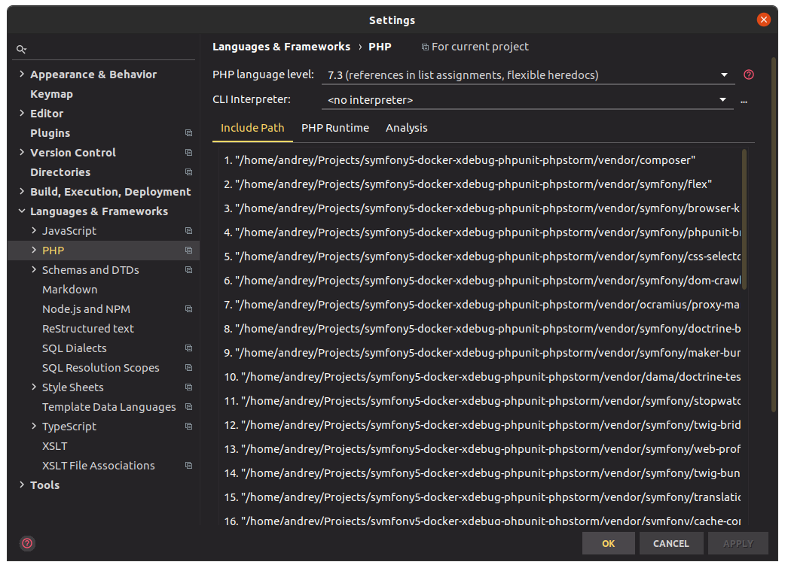

# Настройка PhpStorm для приложения Symfony 5

с описанием развёртывания сервисов в **Docker**, подключения **XDebug** для отладки и анализа покрытия тестами, 
а также настройки **PHPUnit** для тестирования.

---
Вначале приводится описание конфигурации базовых контейнеров для запуска приложения. 
Это Nginx 1.18 в качестве веб сервера, PHP-FPM 7.3 и PostgreSQL 12.5 для базы данных. Все 
файлы для Docker хранятся в каталоге **.docker**. В корне проекта находится только **Makefile** для 
упрощения запуска команд. 

По-умолчанию все контейнеры, описанные в файле **docker-compose.yml**, запускаются в одной 
виртуальной сети. Но в этом примере настройки сети явно сконфигурированы. Это даёт 
возможность управлять параметрами сети, подключать в эту сеть контейнеры других проектов,
а также локально определить имя хоста на локальной машине, чтобы сайт был доступен
не по IP, а по доменному имени.

В сборке установлены распространённые инструменты:
+ profiler
+ logger
+ annotations
+ orm
+ security
+ maker (dev)
+ debug (dev)
+ phpunit (dev)  
+ browser-kit (dev)
+ dama/doctrine-test-bundle (dev) - для очистки БД между прогонами тестов

## PostgreSQL
Это наиболее простой в настройке сервис. Используется образ **postgres:12.5**. Параметры запуска 
сервиса имеют настройки по-умолчанию, но при желании их можно переопределить. Для того, чтобы 
сохранить данные после удаления контейнера, используется настройка **volumes**. Все 
файлы базы данных будут сохранены локально в каталог **.docker/storage/postgres**. 

## PHP-PFM
Dockerfile для построения контейнера находится в **.docker/services/php-fpm**. Процесс сборки 
состоит из установки требуемых пакетов и расширений, а также установки **Symfony CLI** и **Composer**. 
В некоторых случаях всё, что связано с окружением разработки, можно вынести в отдельный контейнер. 

При сборке важной является строка `COPY ./services/php-fpm/php.ini /usr/local/etc/php/php.ini`. 
Если php.ini передать с помощью volumes, то PhpStorm не сможет определить версию XDebug, 
что может вызвать проблемы при настройке запуска тестов и определения покрытия тестами.

Нужно обратить внимание на параметры **XDEBUG_CONFIG**. Тут важно запомнить значения **remote_host**
**remote_port** и **serverName**, которые далее будут участвовать в настройке PhpStorm.

## NGINX
Для этого контейнера используется чистый образ **nginx:1.18.0**. Через **volumes** пробрасываются 
настройки сайта **nginx.conf**, а также каталог для доступа к логам и их локального 
хранения. Дополнительно проставляется статичный IP в виртуальной сети docker, по которому 
будет работать сайт. Можно добавить доменное имя в файл **/etc/hosts** для удобства. 

## Запуск приложения

Для запуска приложения нужно выполнить две команды:
```
cp .env.dist .env
make start
```

# Настройка PhpStorm

### Directories
Небольшая заметка про настройку директорий для проекта Symfony (File | Settings | Directories). 
Необходимо исключить каталоги **var** и **vendor**, а каталогам **src** и **tests** назначить 
namespace (иконка **карандаш** в правой части окна напротив наименования каталога): 


### CLI Interpreter
Для подключения удалённого интерпретатора необходимо открыть страницу настройки **PHP** (File | Settings 
 Languages & Frameworks | PHP). Здесь нужно изменить **PHP Language level** на 7.3, или тот, который 
используется в проекте. Далее добавить новый интерпретатор, нажав кнопку `...` на строке **CLI Interpreter**: 



В открывшемся окне нажать кнопку `+`, и выбрать в меню пункт `From Docker, Vagrant, VM, WSL, Remote...`: 


В следующем всплывающем окне следует выбрать такие значения. Важно использовать файл **docker-compose.yml**, 
иначе не будет возможности запускать тесты в запущенном контейнере. Для варианта **Docker** PhpStorm
будет всегда запускать новый безымянный контейнер, и могут возникнуть проблемы с доступом к контейнеру
базы данных для функциональных тестов:


После нажатия на кнопку `OK` PhpStorm попытается определить версию PHP и Xdebug. Если php.ini добавлен в 
контейнер операцией COPY, а не подключается через volumes, то определение должно пройти успешно.
В данном окне следует изменить значение **"Lifecycle"** на **"Connect to existing container"**, чтобы при 
запуск тестов происходил в запущенных контейнерах:


Нужно обратить внимание на значение **"Path mappings"**, т.к. в нём указан путь к каталогу проекта внутри 
контейнера. При желании исходя из собственных предпочтений можно изменить это значение. В итоге в 
окне настройки PHP должно получиться примерно так:


### XDebug

В первую очередь нужно добавить сервер на странице настройки **Servers** (File | Settings | Languages 
& Frameworks | PHP | Servers). В качестве наименования сервера нужно прописать значение, которое было
которое было указано ранее в **docker-compose.yml** - **xdebug_server**. В качестве хоста - хост для 
XDebug **172.22.0.1**. И обязательно поставить галочку **"Use path mappings"** и указать для 
каталога проекта **"Absolute path on the server"** тот путь, который мапится в контейнер. В данном случае 
**/var/www**:


Далее на вкладке **Debug** (File | Settings | Languages & Frameworks | PHP | Debug) нужно указать порт 
**debug port** = **9000** из **docker-compose.yml** файла:


Для того, чтобы проверить правильность настройки, следует открыть окно **"Validate Debugger 
Configuration on Web Server"**, кликнув на ссылку **"Validate"** в первом пункте списка **"Pre-configuration"**.
В строке **"Path to create validation script"** следует указать каталог **".../public"**, где лежит
файл **index.php**, а в **"Url to validation script"** указать хост и порт приложения. В данном 
случае это может быть **"localhost"** или **"172.22.0.80"**, который был указан для контейнера **Nginx**.
После этого нажать кнопку `VALIDATE`. Если в предыдущих шагах всё было правильно настроено, 
в поле **"Information"** будут выведены все зелёные галочки. В случае ошибки следует проверить предыдущие настройки:
  


Проверить работу XDebug можно поставив точку breakpoint на любой строке контроллера **DefaultController**.
На панели инструментов нужно нажать кнопку **"Start Listening for PHP Debug Connections"**. Сейчас
если открыть браузер и перейти по адресу `http://172.22.0.80`, выполнение скрипта остановится на указанной строке.


### PhpUnit

Т.к. **Symfony** использует рецепт **"symfony/phpunit-bridge"** для тестирования, исполняющий скрипт 
**phpunit** размещается в каталоге **./bin**. Все зависимости, используемые для тестирования, 
устанавливаются в каталог **./bin/.phpunit**. Для установки зависимостей следует один раз вызвать команду
`make test`.

_Примечание_: При установке пакета был создан файл **phpunit.xml.dist**,
в котором указана конкретная версия **PHPUnit**. Чтобы использовать более свежую версию библиотеки,
была удалена строка `<server name="SYMFONY_PHPUNIT_VERSION" value="7.5" />` из файла. 

После установки зависимостей требуется добавить каталог **./bin/.phpunit** в **"Include Path"** 
на странице настроек **PHP** (File | Settings | Languages & Frameworks | PHP). Для этого нужно 
пролистать список зависимостей вниз, нажать кнопку `+` и выбрать пункт **"Specify Other..."**. Далее 
указать путь к каталогу **./bin/.phpunit**, для того, чтобы PhpStorm определял классы библиотеки 
PhpUnit. 


Для запуска тестов **PhpUnit** требуется добавить конфигурацию, кликнув на панели инструментов кнопку 
`ADD CONFIGURATION...`. В левой части в открывшемся окне следует нажать кнопку `+` и выбрать пункт 
**PHPUnit**. В правой части окна нужно указать наименование и выбрать интерпретатор, который был 
сконфигурирован ранее. После этого нажать на кнопку в конце строки **"Use alternative configuration 
file"** с тремя вертикальными точками:


Откроется окно **"Test Frameworks"**. Тут нужно добавить новую конфигурацию **"PHPUnit by Remote 
Interpreter"** и заполнить поля как указано на рисунке. Указать путь к исполняемому файлу 
**"phpunit.phar"** и **"Default configuration file"** внутри контейнера, после чего PhpStorm должен 
определить версию библиотеки PHPUnit: 


В проект уже добавлена одна сущность **User**, репозиторий и функциональный тест контроллера. Дополнительно
в проект установлен пакет **dama/doctrine-test-bundle**, с помощью которого после выполнения каждого 
теста происходит откат изменений БД. Для запуска тестов остаётся нажать кнопку **"Run 'Tests'"** рядом 
с выбором конфигурации на панели инструментов:


### Coverage

Анализ покрытия кода тестами можно выполнить как с помощью **XDebug**, так и с помощью **PCov**, который также
установлен в контейнер PHP.  


Для запуска анализа покрытия тестами следует нажать кнопку **"Run 'Tests' with Coverage"** - вторую 
справа от кнопки запуска тестов. После выполнения данной процедуры на панели **Project** рядом с 
наименованием файлов будут указаны значения покрытия кода тестами, а код внутри файлов будет отмечен 
как покрытый и не покрытый тестами:  


На этом всё. Удачи!
